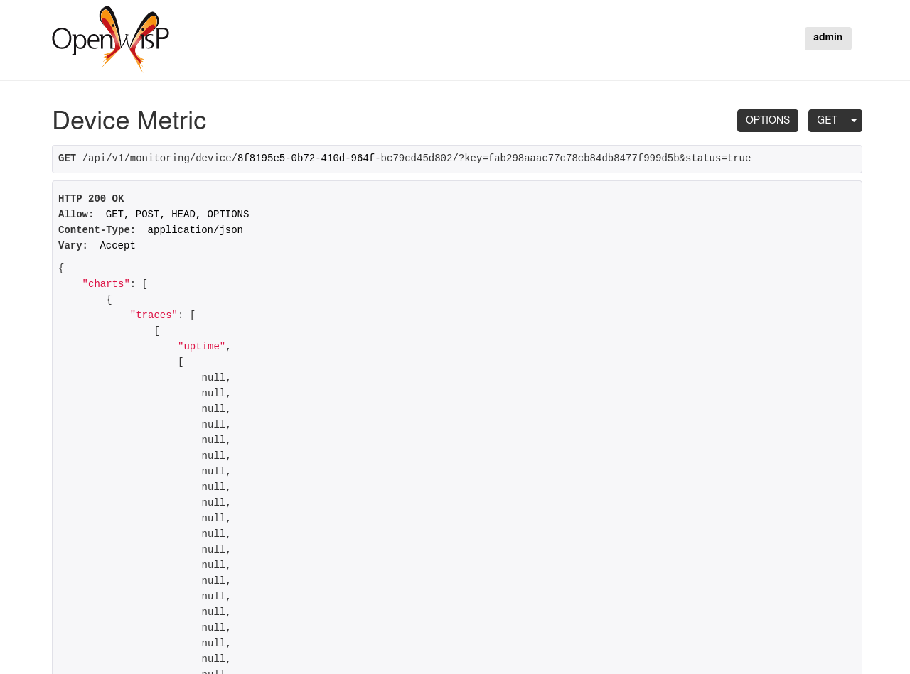
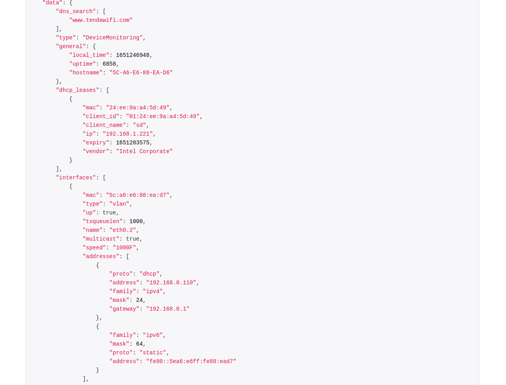

openwisp-monitoring
===================

.. image:: https://github.com/openwisp/openwisp-monitoring/workflows/OpenWISP%20Monitoring%20CI%20Build/badge.svg?branch=master
    :target: https://github.com/openwisp/openwisp-monitoring/actions?query=workflow%3A%22OpenWISP+Monitoring+CI+Build%22
    :alt: CI build status

.. image:: https://coveralls.io/repos/github/openwisp/openwisp-monitoring/badge.svg?branch=master
    :target: https://coveralls.io/github/openwisp/openwisp-monitoring?branch=master
    :alt: Test coverage

.. image:: https://requires.io/github/openwisp/openwisp-monitoring/requirements.svg?branch=master
   :target: https://requires.io/github/openwisp/openwisp-monitoring/requirements/?branch=master
   :alt: Requirements Status

.. image:: https://badge.fury.io/py/openwisp-monitoring.svg
    :target: http://badge.fury.io/py/openwisp-monitoring
    :alt: pypi

.. image:: https://pepy.tech/badge/openwisp-monitoring
   :target: https://pepy.tech/project/openwisp-monitoring
   :alt: downloads

.. image:: https://img.shields.io/gitter/room/nwjs/nw.js.svg?style=flat-square
   :target: https://gitter.im/openwisp/monitoring
   :alt: support chat

.. image:: https://img.shields.io/badge/code%20style-black-000000.svg
   :target: https://pypi.org/project/black/
   :alt: code style: black

------------

OpenWISP Monitoring is a network monitoring system written in Python and Django,
designed to be **extensible**, **programmable**, **scalable** and easy to use by end users:
once the system is configured, monitoring checks, alerts and metric collection
happens automatically.

See the `available features <#available-features>`_.

`OpenWISP <http://openwisp.org>`_ is not only an application designed for end users,
but can also be used as a framework on which custom network automation solutions can be
built on top of its building blocks.

Other popular building blocks that are part of the OpenWISP ecosystem are:

- `openwisp-controller <https://github.com/openwisp/openwisp-controller>`_:
  network and WiFi controller: provisioning, configuration management,
  x509 PKI management and more; works on OpenWRT, but designed to work also on other systems.
- `openwisp-network-topology <https://github.com/openwisp/openwisp-network-topology>`_:
  provides way to collect and visualize network topology data from
  dynamic mesh routing daemons or other network software (eg: OpenVPN);
  it can be used in conjunction with openwisp-monitoring to get a better idea
  of the state of the network
- `openwisp-firmware-upgrader <https://github.com/openwisp/openwisp-firmware-upgrader>`_:
  automated firmware upgrades (single device or mass network upgrades)
- `openwisp-radius <https://github.com/openwisp/openwisp-radius>`_:
  based on FreeRADIUS, allows to implement network access authentication systems like
  802.1x WPA2 Enterprise, captive portal authentication, Hotspot 2.0 (802.11u)
- `openwisp-ipam <https://github.com/openwisp/openwisp-ipam>`_:
  it allows to manage the IP address space of networks

.. figure:: https://github.com/openwisp/openwisp-monitoring/raw/master/docs/dashboard.png
  :align: center

.. figure:: https://drive.google.com/uc?export=view&id=1GuB5HsyiZejBzXKZJnM8QJCUJt1Z5IkJ
  :align: center

Available Features
------------------

* Collection of monitoring information in a timeseries database (currently only influxdb is supported)
* Allows to browse alerts easily from the user interface with one click
* Collects and displays `device status <#device-status>`_ information like
  uptime, RAM status, CPU load averages,
  Interface properties and addresses, WiFi interface status and associated clients,
  Neighbors information, DHCP Leases, Disk/Flash status
* Monitoring charts for `uptime <#ping>`_, `packet loss <#ping>`_,
  `round trip time (latency) <#ping>`_,
  `associated wifi clients <#wifi-clients>`_, `interface traffic <#traffic>`_,
  `RAM usage <#memory-usage>`_, `CPU load <#cpu-load>`_, `flash/disk usage <#disk-usage>`_,
  mobile signal (LTE/UMTS/GSM `signal strength <#mobile-signal-strength>`_,
  `signal quality <#mobile-signal-quality>`_,
  `access technology in use <#mobile-access-technology-in-use>`_)
* Charts can be viewed at resolutions of 1 day, 3 days, a week, a month and a year
* Configurable alerts
* CSV Export of monitoring data
* An overview of the status of the network is shown in the admin dashboard,
  a chart shows the percentages of devices which are online, offline or having issues;
  a geographic map is also available for those who use the geographic features of OpenWISP
* Possibility to configure additional `Metrics <#openwisp_monitoring_metrics>`_ and `Charts <#openwisp_monitoring_charts>`_
* Extensible active check system: it's possible to write additional checks that
  are run periodically using python classes
* Extensible metrics and charts: it's possible to define new metrics and new charts
* API to retrieve the chart metrics and status information of each device
  based on `NetJSON DeviceMonitoring <http://netjson.org/docs/what.html#devicemonitoring>`_

------------

.. contents:: **Table of Contents**:
   :backlinks: none
   :depth: 3

------------

Install Dependencies
--------------------

We use InfluxDB to store metrics and Redis as celery broker (you can use a different
broker if you want). The recommended way for development is running them using Docker
so you will need to `install docker and docker-compose <https://docs.docker.com/engine/install/>`_
beforehand.

In case you prefer not to use Docker you can `install InfluxDB <https://docs.influxdata.com/influxdb/v1.8/introduction/install/>`_
and Redis from your repositories, but keep in mind that the version packaged by your distribution may be different.

Install spatialite and sqlite:

.. code-block:: shell

    sudo apt-get install -y sqlite3 libsqlite3-dev openssl libssl-dev \
                            gdal-bin libproj-dev libgeos-dev libspatialite-dev \
                            fping

Setup (integrate in an existing Django project)
-----------------------------------------------

Follow the setup instructions of `openwisp-controller
<https://github.com/openwisp/openwisp-controller>`_, then add the settings described below.

.. code-block:: python

    INSTALLED_APPS = [
        # django apps
        # all-auth
        'django.contrib.sites',
        'allauth',
        'allauth.account',
        'allauth.socialaccount',
        'django_extensions',
        'django_filters',
        # openwisp2 modules
        'openwisp_users',
        'openwisp_controller.pki',
        'openwisp_controller.config',
        'openwisp_controller.connection',
        'openwisp_controller.geo',
        # monitoring
        'openwisp_monitoring.monitoring',
        'openwisp_monitoring.device',
        'openwisp_monitoring.check',
        'nested_admin',
        # notifications
        'openwisp_notifications',
        # openwisp2 admin theme (must be loaded here)
        'openwisp_utils.admin_theme',
        # admin
        'django.contrib.admin',
        'django.forms',
        # other dependencies ...
    ]

    # Make sure you change them in production
    # You can select one of the backends located in openwisp_monitoring.db.backends
    TIMESERIES_DATABASE = {
        'BACKEND': 'openwisp_monitoring.db.backends.influxdb',
        'USER': 'openwisp',
        'PASSWORD': 'openwisp',
        'NAME': 'openwisp2',
        'HOST': 'localhost',
        'PORT': '8086',
    }

``urls.py``:

.. code-block:: python

    from django.conf import settings
    from django.conf.urls import include, url
    from django.contrib.staticfiles.urls import staticfiles_urlpatterns

    from openwisp_utils.admin_theme.admin import admin, openwisp_admin

    openwisp_admin()

    urlpatterns = [
        url(r'^admin/', include(admin.site.urls)),
        url(r'', include('openwisp_controller.urls')),
        url(r'', include('openwisp_monitoring.urls')),
    ]

    urlpatterns += staticfiles_urlpatterns()

Configure caching (you may use a different cache storage if you want):

.. code-block:: python

    CACHES = {
        'default': {
            'BACKEND': 'django_redis.cache.RedisCache',
            'LOCATION': 'redis://localhost/0',
            'OPTIONS': {
                'CLIENT_CLASS': 'django_redis.client.DefaultClient',
            }
        }
    }

    SESSION_ENGINE = 'django.contrib.sessions.backends.cache'
    SESSION_CACHE_ALIAS = 'default'

Configure celery (you may use a different broker if you want):

.. code-block:: python

    # here we show how to configure celery with redis but you can
    # use other brokers if you want, consult the celery docs
    CELERY_BROKER_URL = 'redis://localhost/1'
    CELERY_BEAT_SCHEDULE = {
        'run_checks': {
            'task': 'openwisp_monitoring.check.tasks.run_checks',
            'schedule': timedelta(minutes=5),
        },
    }

    INSTALLED_APPS.append('djcelery_email')
    EMAIL_BACKEND = 'djcelery_email.backends.CeleryEmailBackend'

If you decide to use redis (as shown in these examples),
install the requierd python packages::

    pip install redis django-redis

Device Health Status
--------------------

The possible values for the health status field (``DeviceMonitoring.status``)
are explained below.

``UNKNOWN``
~~~~~~~~~~~

Whenever a new device is created it will have ``UNKNOWN`` as it's default Heath Status.

It implies that the system doesn't know whether the device is reachable yet.

``OK``
~~~~~~

Everything is working normally.

``PROBLEM``
~~~~~~~~~~~

One of the metrics has a value which is not in the expected range
(the threshold value set in the alert settings has been crossed).

Example: CPU usage should be less than 90% but current value is at 95%.

``CRITICAL``
~~~~~~~~~~~~

One of the metrics defined in ``OPENWISP_MONITORING_CRITICAL_DEVICE_METRICS``
has a value which is not in the expected range
(the threshold value set in the alert settings has been crossed).

Example: ping is by default a critical metric which is expected to be always 1
(reachable).

Default Metrics
---------------

Device Status
~~~~~~~~~~~~~

This metric stores the status of the device for viewing purposes.

.. figure:: https://github.com/openwisp/openwisp-monitoring/raw/master/docs/device-status-1.png
  :align: center

.. figure:: https://github.com/openwisp/openwisp-monitoring/raw/master/docs/device-status-2.png
  :align: center

.. figure:: https://github.com/openwisp/openwisp-monitoring/raw/master/docs/device-status-3.png
  :align: center

.. figure:: https://github.com/openwisp/openwisp-monitoring/raw/master/docs/device-status-4.png
  :align: center

Ping
~~~~

+--------------------+----------------------------------------------------------------+
| **measurement**:   | ``ping``                                                       |
+--------------------+----------------------------------------------------------------+
| **types**:         | ``int`` (reachable and loss), ``float`` (rtt)                  |
+--------------------+----------------------------------------------------------------+
| **fields**:        | ``reachable``, ``loss``, ``rtt_min``, ``rtt_max``, ``rtt_avg`` |
+--------------------+----------------------------------------------------------------+
| **configuration**: | ``ping``                                                       |
+--------------------+----------------------------------------------------------------+
| **charts**:        | ``uptime``, ``packet_loss``, ``rtt``                           |
+--------------------+----------------------------------------------------------------+

**Uptime**:

.. figure:: https://github.com/openwisp/openwisp-monitoring/raw/master/docs/uptime.png
  :align: center

**Packet loss**:

.. figure:: https://github.com/openwisp/openwisp-monitoring/raw/master/docs/packet-loss.png
  :align: center

**Round Trip Time**:

.. figure:: https://github.com/openwisp/openwisp-monitoring/raw/master/docs/rtt.png
  :align: center

Traffic
~~~~~~~

+--------------------+----------------------------+
| **measurement**:   | ``<interface_name>``       |
+--------------------+----------------------------+
| **type**:          | ``int``                    |
+--------------------+----------------------------+
| **fields**:        | ``rx_bytes``, ``tx_bytes`` |
+--------------------+----------------------------+
| **configuration**: | ``traffic``                |
+--------------------+----------------------------+
| **charts**:        | ``traffic``                |
+--------------------+----------------------------+

.. figure:: https://github.com/openwisp/openwisp-monitoring/raw/master/docs/traffic.png
  :align: center

WiFi Clients
~~~~~~~~~~~~

+--------------------+--------------------------+
| **measurement**:   | ``<interface_name>``     |
+--------------------+--------------------------+
| **type**:          | ``int``                  |
+--------------------+--------------------------+
| **fields**:        | ``clients``              |
+--------------------+--------------------------+
| **configuration**: | ``clients``              |
+--------------------+--------------------------+
| **charts**:        | ``wifi_clients``         |
+--------------------+--------------------------+

.. figure:: https://github.com/openwisp/openwisp-monitoring/raw/master/docs/wifi-clients.png
  :align: center

Memory Usage
~~~~~~~~~~~~

+--------------------+--------------------------------------------------------------------------------------------------------------------------------------+
| **measurement**:   | ``<memory>``                                                                                                                         |
+--------------------+--------------------------------------------------------------------------------------------------------------------------------------+
| **type**:          | ``float``                                                                                                                            |
+--------------------+--------------------------------------------------------------------------------------------------------------------------------------+
| **fields**:        | ``percent_used``, ``free_memory``, ``total_memory``, ``buffered_memory``, ``shared_memory``, ``cached_memory``, ``available_memory`` |
+--------------------+--------------------------------------------------------------------------------------------------------------------------------------+
| **configuration**: | ``memory``                                                                                                                           |
+--------------------+--------------------------------------------------------------------------------------------------------------------------------------+
| **charts**:        | ``memory``                                                                                                                           |
+--------------------+--------------------------------------------------------------------------------------------------------------------------------------+

.. figure:: https://github.com/openwisp/openwisp-monitoring/raw/master/docs/memory.png
  :align: center

CPU Load
~~~~~~~~

+--------------------+----------------------------------------------------+
| **measurement**:   | ``load``                                           |
+--------------------+----------------------------------------------------+
| **type**:          | ``float``                                          |
+--------------------+----------------------------------------------------+
| **fields**:        | ``cpu_usage``, ``load_1``, ``load_5``, ``load_15`` |
+--------------------+----------------------------------------------------+
| **configuration**: | ``load``                                           |
+--------------------+----------------------------------------------------+
| **charts**:        | ``load``                                           |
+--------------------+----------------------------------------------------+

.. figure:: https://github.com/openwisp/openwisp-monitoring/raw/master/docs/cpu-load.png
  :align: center

Disk Usage
~~~~~~~~~~

+--------------------+-------------------+
| **measurement**:   | ``disk``          |
+--------------------+-------------------+
| **type**:          | ``float``         |
+--------------------+-------------------+
| **fields**:        | ``used_disk``     |
+--------------------+-------------------+
| **configuration**: | ``disk``          |
+--------------------+-------------------+
| **charts**:        | ``disk``          |
+--------------------+-------------------+

.. figure:: https://github.com/openwisp/openwisp-monitoring/raw/master/docs/disk-usage.png
  :align: center

Mobile Signal Strength
~~~~~~~~~~~~~~~~~~~~~~

+--------------------+-----------------------------------------+
| **measurement**:   | ``signal_strength``                     |
+--------------------+-----------------------------------------+
| **type**:          | ``float``                               |
+--------------------+-----------------------------------------+
| **fields**:        | ``signal_strength``, ``signal_power``   |
+--------------------+-----------------------------------------+
| **configuration**: | ``signal_strength``                     |
+--------------------+-----------------------------------------+
| **charts**:        | ``signal_strength``                     |
+--------------------+-----------------------------------------+

.. figure:: https://github.com/openwisp/openwisp-monitoring/raw/docs/docs/signal-strength.png
  :align: center

Mobile Signal Quality
~~~~~~~~~~~~~~~~~~~~~~

+--------------------+-----------------------------------------+
| **measurement**:   | ``signal_quality``                      |
+--------------------+-----------------------------------------+
| **type**:          | ``float``                               |
+--------------------+-----------------------------------------+
| **fields**:        | ``signal_quality``, ``signal_quality``  |
+--------------------+-----------------------------------------+
| **configuration**: | ``signal_quality``                      |
+--------------------+-----------------------------------------+
| **charts**:        | ``signal_quality``                      |
+--------------------+-----------------------------------------+

.. figure:: https://github.com/openwisp/openwisp-monitoring/raw/docs/docs/signal-quality.png
  :align: center

Mobile Access Technology in use
~~~~~~~~~~~~~~~~~~~~~~~~~~~~~~~

+--------------------+-------------------+
| **measurement**:   | ``access_tech``   |
+--------------------+-------------------+
| **type**:          | ``int``           |
+--------------------+-------------------+
| **fields**:        | ``access_tech``   |
+--------------------+-------------------+
| **configuration**: | ``access_tech``   |
+--------------------+-------------------+
| **charts**:        | ``access_tech``   |
+--------------------+-------------------+

.. figure:: https://github.com/openwisp/openwisp-monitoring/raw/docs/docs/access-technology.png
  :align: center

Default Alerts / Notifications
------------------------------

+-------------------------------+------------------------------------------------------------------+
| Notification Type             | Use                                                              |
+-------------------------------+------------------------------------------------------------------+
| ``threshold_crossed``         | Fires when a metric crosses the boundary defined in the          |
|                               | threshold value of the alert settings.                           |
+-------------------------------+------------------------------------------------------------------+
| ``threshold_recovery``        | Fires when a metric goes back within the expected range.         |
+-------------------------------+------------------------------------------------------------------+
| ``connection_is_working``     | Fires when the connection to a device is working.                |
+-------------------------------+------------------------------------------------------------------+
| ``connection_is_not_working`` | Fires when the connection (eg: SSH) to a device stops working    |
|                               | (eg: credentials are outdated, management IP address is          |
|                               | outdated, or device is not reachable).                           |
+-------------------------------+------------------------------------------------------------------+

Available Checks
----------------

Ping
~~~~

This check returns information on device ``uptime`` and ``RTT (Round trip time)``.
The Charts ``uptime``, ``packet loss`` and ``rtt`` are created. The ``fping``
command is used to collect these metrics.
You may choose to disable auto creation of this check by setting
`OPENWISP_MONITORING_AUTO_PING <#OPENWISP_MONITORING_AUTO_PING>`_ to ``False``.

Configuration applied
~~~~~~~~~~~~~~~~~~~~~

This check ensures that the `openwisp-config agent <https://github.com/openwisp/openwisp-config/>`_
is running and applying configuration changes in a timely manner.
You may choose to disable auto creation of this check by using the
setting `OPENWISP_MONITORING_AUTO_DEVICE_CONFIG_CHECK <#OPENWISP_MONITORING_AUTO_DEVICE_CONFIG_CHECK>`_.

This check runs periodically, but it is also triggered whenever the
configuration status of a device changes, this ensures the check reacts
quickly to events happening in the network and informs the user promptly
if there's anything that is not working as intended.

Settings
--------

``OPENWISP_MONITORING_SHORT_RETENTION_POLICY``
~~~~~~~~~~~~~~~~~~~~~~~~~~~~~~~~~~~~~~~~~~~~~~

+--------------+-------------+
| **type**:    | ``str``     |
+--------------+-------------+
| **default**: | ``24h0m0s`` |
+--------------+-------------+

The default retention policy used to store raw device data.

This data is only used to assess the recent status of devices, keeping
it for a long time would not add much benefit and would cost a lot more
in terms of disk space.

``OPENWISP_MONITORING_AUTO_PING``
~~~~~~~~~~~~~~~~~~~~~~~~~~~~~~~~~

+--------------+-------------+
| **type**:    | ``bool``    |
+--------------+-------------+
| **default**: | ``True``    |
+--------------+-------------+

Whether ping checks are created automatically for devices.

``OPENWISP_MONITORING_AUTO_DEVICE_CONFIG_CHECK``
~~~~~~~~~~~~~~~~~~~~~~~~~~~~~~~~~~~~~~~~~~~~~~~~

+--------------+-------------+
| **type**:    | ``bool``    |
+--------------+-------------+
| **default**: | ``True``    |
+--------------+-------------+

This setting allows you to choose whether `config_applied <#configuration-applied>`_ checks should be
created automatically for newly registered devices. It's enabled by default.

``OPENWISP_MONITORING_AUTO_CHARTS``
~~~~~~~~~~~~~~~~~~~~~~~~~~~~~~~~~~~

+--------------+-----------------------------------------------------------------+
| **type**:    | ``list``                                                        |
+--------------+-----------------------------------------------------------------+
| **default**: | ``('traffic', 'wifi_clients', 'uptime', 'packet_loss', 'rtt')`` |
+--------------+-----------------------------------------------------------------+

Automatically created charts.

``OPENWISP_MONITORING_CRITICAL_DEVICE_METRICS``
~~~~~~~~~~~~~~~~~~~~~~~~~~~~~~~~~~~~~~~~~~~~~~~

+--------------+-----------------------------------------------------------------+
| **type**:    | ``list`` of ``dict`` objects                                    |
+--------------+-----------------------------------------------------------------+
| **default**: | ``[{'key': 'ping', 'field_name': 'reachable'}]``                |
+--------------+-----------------------------------------------------------------+

Device metrics that are considered critical:

when a value crosses the boundary defined in the "threshold value" field
of the alert settings related to one of these metric types, the health status
of the device related to the metric moves into ``CRITICAL``.

By default, if devices are not reachable by pings they are flagged as ``CRITICAL``.

``OPENWISP_MONITORING_HEALTH_STATUS_LABELS``
~~~~~~~~~~~~~~~~~~~~~~~~~~~~~~~~~~~~~~~~~~~~

+--------------+--------------------------------------------------------------------------------------+
| **type**:    | ``dict``                                                                             |
+--------------+--------------------------------------------------------------------------------------+
| **default**: | ``{'unknown': 'unknown', 'ok': 'ok', 'problem': 'problem', 'critical': 'critical'}`` |
+--------------+--------------------------------------------------------------------------------------+

This setting allows to change the health status labels, for example, if we
want to use ``online`` instead of ``ok`` and ``offline`` instead of ``critical``,
you can use the following configuration:

.. code-block:: python

    OPENWISP_MONITORING_HEALTH_STATUS_LABELS = {
        'ok': 'online',
        'problem': 'problem',
        'critical': 'offline'
    }

``OPENWISP_MONITORING_MANAGEMENT_IP_ONLY``
~~~~~~~~~~~~~~~~~~~~~~~~~~~~~~~~~~~~~~~~~~

+--------------+-------------+
| **type**:    | ``bool``    |
+--------------+-------------+
| **default**: | ``True``    |
+--------------+-------------+

By default, only the management IP will be used to perform active checks to
the devices.

If the devices are connecting to your OpenWISP instance using a shared layer2
network, hence the OpenWSP server can reach the devices using the ``last_ip``
field, you can set this to ``False``.

``OPENWISP_MONITORING_DEVICE_RECOVERY_DETECTION``
~~~~~~~~~~~~~~~~~~~~~~~~~~~~~~~~~~~~~~~~~~~~~~~~~

+--------------+-------------+
| **type**:    | ``bool``    |
+--------------+-------------+
| **default**: | ``True``    |
+--------------+-------------+

When device recovery detection is enabled, recoveries are discovered as soon as
a device contacts the openwisp system again (eg: to get the configuration checksum
or to send monitoring metrics).

This feature is enabled by default.

If you use OpenVPN as the management VPN, you may want to check out a similar
integration built in **openwisp-network-topology**: when the status of an OpenVPN link
changes (detected by monitoring the status information of OpenVPN), the
network topology module will trigger the monitoring checks.
For more information see:
`Network Topology Device Integration <https://github.com/openwisp/openwisp-network-topology#integration-with-openwisp-controller-and-openwisp-monitoring>`_

``OPENWISP_MONITORING_MAC_VENDOR_DETECTION``
~~~~~~~~~~~~~~~~~~~~~~~~~~~~~~~~~~~~~~~~~~~~

+--------------+-------------+
| **type**:    | ``bool``    |
+--------------+-------------+
| **default**: | ``True``    |
+--------------+-------------+

Indicates whether mac addresses will be complemented with hardware vendor
information by performing lookups on the OUI
(Organization Unique Identifier) table.

This feature is enabled by default.

``OPENWISP_MONITORING_WRITE_RETRY_OPTIONS``
~~~~~~~~~~~~~~~~~~~~~~~~~~~~~~~~~~~~~~~~~~~

+--------------+-----------+
| **type**:    | ``dict``  |
+--------------+-----------+
| **default**: | see below |
+--------------+-----------+

.. code-block:: python

    # default value of OPENWISP_MONITORING_RETRY_OPTIONS:

    dict(
        max_retries=None,
        retry_backoff=True,
        retry_backoff_max=600,
        retry_jitter=True,
    )

Retry settings for recoverable failures during metric writes.

By default if a metric write fails (eg: due to excessive load on timeseries database at that moment)
then the operation will be retried indefinitely with an exponential random backoff and a maximum delay of 10 minutes.

This feature makes the monitoring system resilient to temporary outages and helps to prevent data loss.

For more information regarding these settings, consult the `celery documentation
regarding automatic retries for known errors
<https://docs.celeryproject.org/en/stable/userguide/tasks.html#automatic-retry-for-known-exceptions>`_.

``OPENWISP_MONITORING_DASHBOARD_MAP``
~~~~~~~~~~~~~~~~~~~~~~~~~~~~~~~~~~~~~

+--------------+-------------+
| **type**:    | ``bool``    |
+--------------+-------------+
| **default**: | ``True``    |
+--------------+-------------+

Whether the geographic map in the dashboard is enabled or not.
This feature provides a geographic map which shows the locations
which have devices installed in and provides a visual representation
of the monitoring status of the devices, this allows to get
an overview of the network at glance.

This feature is enabled by default and depends on the setting
``OPENWISP_ADMIN_DASHBOARD_ENABLED`` from
`openwisp-utils <https://github.com/openwisp/openwisp-utils>`__
being set to ``True`` (which is the default).

You can turn this off if you do not use the geographic features
of OpenWISP.

``OPENWISP_MONITORING_METRICS``
~~~~~~~~~~~~~~~~~~~~~~~~~~~~~~~

+--------------+-------------+
| **type**:    | ``dict``    |
+--------------+-------------+
| **default**: | ``{}``      |
+--------------+-------------+

This setting allows to define additional metric configuration or to override
the default metric configuration defined in
``openwisp_monitoring.monitoring.configuration.DEFAULT_METRICS``.

For example, if you want to change only the **field_name** of
``clients`` metric to ``wifi_clients`` you can use:

.. code-block:: python

    from django.utils.translation import gettext_lazy as _

    OPENWISP_MONITORING_METRICS = {
        'clients': {
            'label': _('WiFi clients'),
            'field_name': 'wifi_clients',
        },
    }

For example, if you want to change only the default alert settings of
``memory`` metric you can use:

.. code-block:: python

    OPENWISP_MONITORING_METRICS = {
        'memory': {
            'alert_settings': {'threshold': 75, 'tolerance': 10}
        },
    }

For example, if you want to change only the notification of
``config_applied`` metric you can use:

.. code-block:: python

    from django.utils.translation import gettext_lazy as _

    OPENWISP_MONITORING_METRICS = {
        'config_applied': {
            'notification': {
                'problem': {
                    'verbose_name': 'Configuration PROBLEM',
                    'verb': _('has not been applied'),
                    'email_subject': _(
                        '[{site.name}] PROBLEM: {notification.target} configuration '
                        'status issue'
                    ),
                    'message': _(
                        'The configuration for device [{notification.target}]'
                        '({notification.target_link}) {notification.verb} in a timely manner.'
                    ),
                },
                'recovery': {
                    'verbose_name': 'Configuration RECOVERY',
                    'verb': _('configuration has been applied again'),
                    'email_subject': _(
                        '[{site.name}] RECOVERY: {notification.target} {notification.verb} '
                        'successfully'
                    ),
                    'message': _(
                        'The device [{notification.target}]({notification.target_link}) '
                        '{notification.verb} successfully.'
                    ),
                },
            },
        },
    }

Or if you want to define a new metric configuration, which you can then
call in your custom code (eg: a custom check class), you can do so as follows:

.. code-block:: python

    from django.utils.translation import gettext_lazy as _

    OPENWISP_MONITORING_METRICS = {
        'top_fields_mean': {
            'name': 'Top Fields Mean',
            'key': '{key}',
            'field_name': '{field_name}',
            'label': '_(Top fields mean)',
            'related_fields': ['field1', 'field2', 'field3'],
        },
    }

``OPENWISP_MONITORING_CHARTS``
~~~~~~~~~~~~~~~~~~~~~~~~~~~~~~

+--------------+-------------+
| **type**:    | ``dict``    |
+--------------+-------------+
| **default**: | ``{}``      |
+--------------+-------------+

This setting allows to define additional charts or to override
the default chart configuration defined in
``openwisp_monitoring.monitoring.configuration.DEFAULT_CHARTS``.

For example, if you want to change the traffic chart to show
MB (megabytes) instead of GB (Gigabytes) you can use:

.. code-block:: python

    OPENWISP_MONITORING_CHARTS = {
        'traffic': {
            'unit': ' MB',
            'description': (
                'Network traffic, download and upload, measured on '
                'the interface "{metric.key}", measured in MB.'
            ),
            'query': {
                'influxdb': (
                    "SELECT SUM(tx_bytes) / 1000000 AS upload, "
                    "SUM(rx_bytes) / 1000000 AS download FROM {key} "
                    "WHERE time >= '{time}' AND content_type = '{content_type}' "
                    "AND object_id = '{object_id}' GROUP BY time(1d)"
                )
            },
        }
    }

Or if you want to define a new chart configuration, which you can then
call in your custom code (eg: a custom check class), you can do so as follows:

.. code-block:: python

    from django.utils.translation import gettext_lazy as _

    OPENWISP_MONITORING_CHARTS = {
        'ram': {
            'type': 'line',
            'title': 'RAM usage',
            'description': 'RAM usage',
            'unit': 'bytes',
            'order': 100,
            'query': {
                'influxdb': (
                    "SELECT MEAN(total) AS total, MEAN(free) AS free, "
                    "MEAN(buffered) AS buffered FROM {key} WHERE time >= '{time}' AND "
                    "content_type = '{content_type}' AND object_id = '{object_id}' "
                    "GROUP BY time(1d)"
                )
            },
        }
    }

In case you just want to change the colors used in a chart here's how to do it:

.. code-block:: python

    OPENWISP_MONITORING_CHARTS = {
        'traffic': {
            'colors': ['#000000', '#cccccc']
        }
    }

``OPENWISP_MONITORING_AUTO_CLEAR_MANAGEMENT_IP``
~~~~~~~~~~~~~~~~~~~~~~~~~~~~~~~~~~~~~~~~~~~~~~~~

+--------------+-------------+
| **type**:    | ``bool``    |
+--------------+-------------+
| **default**: | ``True``    |
+--------------+-------------+

This setting allows you to automatically clear management_ip of a device
when it goes offline. It is enabled by default.

``OPENWISP_MONITORING_API_URLCONF``
~~~~~~~~~~~~~~~~~~~~~~~~~~~~~~~~~~~

+--------------+-------------+
| **type**:    | ``string``  |
+--------------+-------------+
| **default**: | ``None``    |
+--------------+-------------+

Changes the urlconf option of django urls to point the monitoring API
urls to another installed module, example, ``myapp.urls``.
(Useful when you have a seperate API instance.)

``OPENWISP_MONITORING_API_BASEURL``
~~~~~~~~~~~~~~~~~~~~~~~~~~~~~~~~~~~

+--------------+-------------+
| **type**:    | ``string``  |
+--------------+-------------+
| **default**: | ``None``    |
+--------------+-------------+

If you have a seperate server for API of openwisp-monitoring on a different
domain, you can use this option to change the base of the url, this will
enable you to point all the API urls to your openwisp-monitoring API server's
domain, example: ``https://mymonitoring.myapp.com``.

Registering / Unregistering Metric Configuration
------------------------------------------------

**OpenWISP Monitoring** provides registering and unregistering metric configuration through utility functions
``openwisp_monitoring.monitoring.configuration.register_metric`` and ``openwisp_monitoring.monitoring.configuration.unregister_metric``.
Using these functions you can register or unregister metric configurations from anywhere in your code.

``register_metric``
~~~~~~~~~~~~~~~~~~~

This function is used to register a new metric configuration from anywhere in your code.

+--------------------------+------------------------------------------------------+
|      **Parameter**       |                   **Description**                    |
+--------------------------+------------------------------------------------------+
|     **metric_name**:     | A ``str`` defining name of the metric configuration. |
+--------------------------+------------------------------------------------------+
|**metric_configuration**: | A ``dict`` defining configuration of the metric.     |
+--------------------------+------------------------------------------------------+

An example usage has been shown below.

.. code-block:: python

    from django.utils.translation import gettext_lazy as _
    from openwisp_monitoring.monitoring.configuration import register_metric

    # Define configuration of your metric
    metric_config = {
        'label': _('Ping'),
        'name': 'Ping',
        'key': 'ping',
        'field_name': 'reachable',
        'related_fields': ['loss', 'rtt_min', 'rtt_max', 'rtt_avg'],
        'charts': {
            'uptime': {
                'type': 'bar',
                'title': _('Uptime'),
                'description': _(
                    'A value of 100% means reachable, 0% means unreachable, values in '
                    'between 0% and 100% indicate the average reachability in the '
                    'period observed. Obtained with the fping linux program.'
                ),
                'summary_labels': [_('Average uptime')],
                'unit': '%',
                'order': 200,
                'colorscale': {
                    'max': 100,
                    'min': 0,
                    'label': _('Reachable'),
                    'scale': [
                        [0, '#c13000'],
                        [0.5, '#deed0e'],
                        [1, '#7db201'],
                    ],
                    'map': [
                        [100, '#7db201', _('Reachable')],
                        [33, '#deed0e', _('Partly reachable')],
                        [None, '#c13000', _('Unreachable')],
                    ],
                    'fixed_value': 100,
                },
                'query': chart_query['uptime'],
            },
            'packet_loss': {
                'type': 'bar',
                'title': _('Packet loss'),
                'description': _(
                    'Indicates the percentage of lost packets observed in ICMP probes. '
                    'Obtained with the fping linux program.'
                ),
                'summary_labels': [_('Average packet loss')],
                'unit': '%',
                'colors': '#d62728',
                'order': 210,
                'query': chart_query['packet_loss'],
            },
            'rtt': {
                'type': 'scatter',
                'title': _('Round Trip Time'),
                'description': _(
                    'Round trip time observed in ICMP probes, measuered in milliseconds.'
                ),
                'summary_labels': [
                    _('Average RTT'),
                    _('Average Max RTT'),
                    _('Average Min RTT'),
                ],
                'unit': _(' ms'),
                'order': 220,
                'query': chart_query['rtt'],
            },
        },
        'alert_settings': {'operator': '<', 'threshold': 1, 'tolerance': 0},
        'notification': {
            'problem': {
                'verbose_name': 'Ping PROBLEM',
                'verb': 'cannot be reached anymore',
                'level': 'warning',
                'email_subject': _(
                    '[{site.name}] {notification.target} is not reachable'
                ),
                'message': _(
                    'The device [{notification.target}] {notification.verb} anymore by our ping '
                    'messages.'
                ),
            },
            'recovery': {
                'verbose_name': 'Ping RECOVERY',
                'verb': 'has become reachable',
                'level': 'info',
                'email_subject': _(
                    '[{site.name}] {notification.target} is reachable again'
                ),
                'message': _(
                    'The device [{notification.target}] {notification.verb} again by our ping '
                    'messages.'
                ),
            },
        },
    }

    # Register your custom metric configuration
    register_metric('ping', metric_config)

The above example will register one metric configuration (named ``ping``), three chart
configurations (named ``rtt``, ``packet_loss``, ``uptime``) as defined in the **charts** key,
two notification types (named ``ping_recovery``, ``ping_problem``) as defined in **notification** key.

The ``AlertSettings`` of ``ping`` metric will by default use ``threshold`` and ``tolerance``
defined in the ``alert_settings`` key.
You can always override them and define your own custom values via the *admin*.

**Note**: It will raise ``ImproperlyConfigured`` exception if a metric configuration
is already registered with same name (not to be confused with verbose_name).

If you don't need to register a new metric but need to change a specific key of an
existing metric configuration, you can use `OPENWISP_MONITORING_METRICS <#openwisp_monitoring_metrics>`_.

``unregister_metric``
~~~~~~~~~~~~~~~~~~~~~

This function is used to unregister a metric configuration from anywhere in your code.

+------------------+------------------------------------------------------+
|  **Parameter**   |                   **Description**                    |
+------------------+------------------------------------------------------+
| **metric_name**: | A ``str`` defining name of the metric configuration. |
+------------------+------------------------------------------------------+

An example usage is shown below.

.. code-block:: python

    from openwisp_monitoring.monitoring.configuration import unregister_metric

    # Unregister previously registered metric configuration
    unregister_metric('metric_name')

**Note**: It will raise ``ImproperlyConfigured`` exception if the concerned metric
configuration is not registered.

Registering / Unregistering Chart Configuration
-----------------------------------------------

**OpenWISP Monitoring** provides registering and unregistering chart configuration through utility functions
``openwisp_monitoring.monitoring.configuration.register_chart`` and ``openwisp_monitoring.monitoring.configuration.unregister_chart``.
Using these functions you can register or unregister chart configurations from anywhere in your code.

``register_chart``
~~~~~~~~~~~~~~~~~~

This function is used to register a new chart configuration from anywhere in your code.

+--------------------------+-----------------------------------------------------+
|      **Parameter**       |                   **Description**                   |
+--------------------------+-----------------------------------------------------+
|      **chart_name**:     | A ``str`` defining name of the chart configuration. |
+--------------------------+-----------------------------------------------------+
| **chart_configuration**: | A ``dict`` defining configuration of the chart.     |
+--------------------------+-----------------------------------------------------+

An example usage has been shown below.

.. code-block:: python

    from openwisp_monitoring.monitoring.configuration import register_chart

    # Define configuration of your chart
    chart_config = {
        'type': 'histogram',
        'title': 'Histogram',
        'description': 'Histogram',
        'top_fields': 2,
        'order': 999,
        'query': {
            'influxdb': (
                "SELECT {fields|SUM|/ 1} FROM {key} "
                "WHERE time >= '{time}' AND content_type = "
                "'{content_type}' AND object_id = '{object_id}'"
            )
        },
    }

    # Register your custom chart configuration
    register_chart('chart_name', chart_config)

**Note**: It will raise ``ImproperlyConfigured`` exception if a chart configuration
is already registered with same name (not to be confused with verbose_name).

If you don't need to register a new chart but need to change a specific key of an
existing chart configuration, you can use `OPENWISP_MONITORING_CHARTS <#openwisp_monitoring_charts>`_.

``unregister_chart``
~~~~~~~~~~~~~~~~~~~~

This function is used to unregister a chart configuration from anywhere in your code.

+------------------+-----------------------------------------------------+
|  **Parameter**   |                   **Description**                   |
+------------------+-----------------------------------------------------+
|  **chart_name**: | A ``str`` defining name of the chart configuration. |
+------------------+-----------------------------------------------------+

An example usage is shown below.

.. code-block:: python

    from openwisp_monitoring.monitoring.configuration import unregister_chart

    # Unregister previously registered chart configuration
    unregister_chart('chart_name')

**Note**: It will raise ``ImproperlyConfigured`` exception if the concerned chart
configuration is not registered.

Registering new notification types
----------------------------------

You can define your own notification types using ``register_notification_type`` function from OpenWISP
Notifications. For more information, see the relevant `openwisp-notifications section about registering notification types
<https://github.com/openwisp/openwisp-notifications#registering--unregistering-notification-types>`_.

Once a new notification type is registered, you have to use the `"notify" signal provided in
openwisp-notifications <https://github.com/openwisp/openwisp-notifications#sending-notifications>`_
to send notifications for this type.

Exceptions
----------

``TimeseriesWriteException``
~~~~~~~~~~~~~~~~~~~~~~~~~~~~

**Path**: ``openwisp_monitoring.db.exceptions.TimeseriesWriteException``

If there is any failure due while writing data in timeseries database, this exception shall
be raised with a helpful error message explaining the cause of the failure.
This exception will normally be caught and the failed write task will be retried in the background
so that there is no loss of data if failures occur due to overload of Timeseries server.
You can read more about this retry mechanism at `OPENWISP_MONITORING_WRITE_RETRY_OPTIONS <#openwisp-monitoring-write-retry-options>`_.

``InvalidMetricConfigException``
~~~~~~~~~~~~~~~~~~~~~~~~~~~~~~~~

**Path**: ``openwisp_monitoring.monitoring.exceptions.InvalidMetricConfigException``

This exception shall be raised if the metric configuration is broken.

``InvalidChartConfigException``
~~~~~~~~~~~~~~~~~~~~~~~~~~~~~~~

**Path**: ``openwisp_monitoring.monitoring.exceptions.InvalidChartConfigException``

This exception shall be raised if the chart configuration is broken.

Rest API
--------

Live documentation
~~~~~~~~~~~~~~~~~~

.. image:: docs/api-doc.png

A general live API documentation (following the OpenAPI specification) at ``/api/v1/docs/``.

Browsable web interface
~~~~~~~~~~~~~~~~~~~~~~~

Additionally, opening any of the endpoints `listed below <#list-of-endpoints>`_
directly in the browser will show the `browsable API interface of Django-REST-Framework
<https://www.django-rest-framework.org/topics/browsable-api/>`_,
which makes it even easier to find out the details of each endpoint.

List of endpoints
~~~~~~~~~~~~~~~~~

Since the detailed explanation is contained in the `Live documentation <#live-documentation>`_
and in the `Browsable web page <#browsable-web-interface>`_ of each point,
here we'll provide just a list of the available endpoints,
for further information please open the URL of the endpoint in your browser.

Retrieve device charts and device status data
#############################################

.. code-block:: text

    GET /v1/monitoring/device/{pk}/?key={key}&status=true

The format used for Device Status is inspired by `NetJSON DeviceMonitoring <http://netjson.org/docs/what.html#devicemonitoring>`_.

**Note**: If the request is made without ``?status=true`` then only device charts
data would be returned.

Collect device metrics and status
#################################

.. code-block:: text

    POST /v1/monitoring/device/{pk}/?key={key}

The format used for Device Status is inspired by `NetJSON DeviceMonitoring <http://netjson.org/docs/what.html#devicemonitoring>`_.

Signals
-------

``device_metrics_received``
~~~~~~~~~~~~~~~~~~~~~~~~~~~

**Path**: ``openwisp_monitoring.device.signals.device_metrics_received``

**Arguments**:

- ``instance``: instance of ``Device`` whose metrics have been received
- ``request``: the HTTP request object

This signal is emitted when device metrics are received to the ``DeviceMetric``
view (only when using HTTP POST).

The signal is emitted just before a successful response is returned,
it is not sent if the response was not successful.

``health_status_changed``
~~~~~~~~~~~~~~~~~~~~~~~~~

**Path**: ``openwisp_monitoring.device.signals.health_status_changed``

**Arguments**:

- ``instance``: instance of ``DeviceMonitoring`` whose status has been changed
- ``status``: the status by which DeviceMonitoring's existing status has been updated with

This signal is emitted only if the health status of DeviceMonitoring object gets updated.

``threshold_crossed``
~~~~~~~~~~~~~~~~~~~~~

**Path**: ``openwisp_monitoring.monitoring.signals.threshold_crossed``

**Arguments**:

- ``metric``: ``Metric`` object whose threshold defined in related alert settings was crossed
- ``alert_settings``: ``AlertSettings`` related to the ``Metric``
- ``target``: related ``Device`` object
- ``first_time``: it will be set to true when the metric is written for the first time. It shall be set to false afterwards.

``first_time`` parameter can be used to avoid initiating unneeded actions.
For example, sending recovery notifications.

This signal is emitted when the threshold value of a ``Metric`` defined in
alert settings is crossed.

``pre_metric_write``
~~~~~~~~~~~~~~~~~~~~

**Path**: ``openwisp_monitoring.monitoring.signals.pre_metric_write``

**Arguments**:

- ``metric``: ``Metric`` object whose data shall be stored in timeseries database
- ``values``: metric data that shall be stored in the timeseries database

This signal is emitted for every metric before the write operation is sent to
the timeseries database.

``post_metric_write``
~~~~~~~~~~~~~~~~~~~~~

**Path**: ``openwisp_monitoring.monitoring.signals.post_metric_write``

**Arguments**:

- ``metric``: ``Metric`` object whose data is being stored in timeseries database
- ``values``: metric data that is being stored in the timeseries database

This signal is emitted for every metric after the write operation is successfully
executed in the background.

Management commands
-------------------

``run_checks``
~~~~~~~~~~~~~~

This command will execute all the `available checks <#available-checks>`_ for all the devices.
By default checks are run periodically by *celery beat*. You can learn more
about this in `Setup <#setup-integrate-in-an-existing-django-project>`_.

Example usage:

.. code-block:: shell

    cd tests/
    ./manage.py run_checks

Monitoring scripts
------------------

The monitoring scripts which are automatically installed by a `migration file of device-monitoring app <https://github.com/openwisp/openwisp-monitoring/blob/master/openwisp_monitoring/device/migrations/0002_create_template.py>`_
are required to make the `checks <https://github.com/openwisp/openwisp-monitoring#available-checks>`_ and
`metrics <#openwisp_monitoring_metrics>`_ work.

The ``netjson-monitoring`` script collects the required data from the openwrt device in realtime. This
data is then sent by the ``openwisp-monitoring`` script to the server in the form of JSON data via SSL.
All the dependencies are updated and installed (if needed) by ``update-openwisp-packages`` script.
The OpenWRT dependencies needed for the monitoring scripts to work are ``libubus-lua``, ``lua-cjson`` and
``rpcd-mod-iwinfo``.

**WARNING**: Please create a new template if you wish to implement customizations. If you modify the
default template to create your custom template then your code can get overwritten post an update.

Installing for development
--------------------------

Install your forked repo:

.. code-block:: shell

    git clone git://github.com/<your_fork>/openwisp-monitoring
    cd openwisp-monitoring/
    pip install -e .

Install test requirements:

.. code-block:: shell

    pip install -r requirements-test.txt

Start Redis and InfluxDB using docker-compose:

.. code-block:: shell

    docker-compose up -d redis influxdb

Create the Django database:

.. code-block:: shell

    cd tests/
    ./manage.py migrate
    ./manage.py createsuperuser

Launch development server:

.. code-block:: shell

    ./manage.py runserver 0.0.0.0:8000

You can access the admin interface at http://127.0.0.1:8000/admin/.

Run celery and celery-beat with the following commands
(separate terminal windows are needed):

.. code-block:: shell

    # (cd tests)
    celery -A openwisp2 worker -l info
    celery -A openwisp2 beat -l info

Run tests with:

.. code-block:: shell

    # run qa checks
    ./run-qa-checks

    # standard tests
    ./runtests.py

    # tests for the sample app
    SAMPLE_APP=1 ./runtests.py

When running the last line of the previous example, the environment variable
``SAMPLE_APP`` activates the sample apps in ``/tests/openwisp2/``
which are simple django apps that extend ``openwisp-monitoring`` with
the sole purpose of testing its extensibility, for more information regarding
this concept, read the following section.

Install and run on docker
-------------------------

.. code-block:: shell

    # ``--build`` parameter is useful when you want to
    # rebuild the openwisp-monitoring image with your changes.
    docker-compose up --build

Extending openwisp-monitoring
-----------------------------

One of the core values of the OpenWISP project is `Software Reusability <http://openwisp.io/docs/general/values.html#software-reusability-means-long-term-sustainability>`_,
for this reason *openwisp-monitoring* provides a set of base classes
which can be imported, extended and reused to create derivative apps.

In order to implement your custom version of *openwisp-monitoring*,
you need to perform the steps described in the rest of this section.

When in doubt, the code in the `test project <https://github.com/openwisp/openwisp-monitoring/tree/master/tests/openwisp2/>`_
and the ``sample apps`` namely `sample_check <https://github.com/openwisp/openwisp-monitoring/tree/master/tests/openwisp2/sample_check/>`_,
`sample_monitoring <https://github.com/openwisp/openwisp-monitoring/tree/master/tests/openwisp2/sample_monitoring/>`_, `sample_device_monitoring <https://github.com/openwisp/openwisp-monitoring/tree/master/tests/openwisp2/sample_device_monitoring/>`_
will guide you in the correct direction:
just replicate and adapt that code to get a basic derivative of
*openwisp-monitoring* working.

**Premise**: if you plan on using a customized version of this module,
we suggest to start with it since the beginning, because migrating your data
from the default module to your extended version may be time consuming.

1. Initialize your custom module
~~~~~~~~~~~~~~~~~~~~~~~~~~~~~~~~

The first thing you need to do in order to extend any *openwisp-monitoring* app is create
a new django app which will contain your custom version of that *openwisp-monitoring* app.

A django app is nothing more than a
`python package <https://docs.python.org/3/tutorial/modules.html#packages>`_
(a directory of python scripts), in the following examples we'll call these django apps as
``mycheck``, ``mydevicemonitoring``, ``mymonitoring`` but you can name it how you want::

    django-admin startapp mycheck
    django-admin startapp mydevicemonitoring
    django-admin startapp mymonitoring

Keep in mind that the command mentioned above must be called from a directory
which is available in your `PYTHON_PATH <https://docs.python.org/3/using/cmdline.html#envvar-PYTHONPATH>`_
so that you can then import the result into your project.

Now you need to add ``mycheck`` to ``INSTALLED_APPS`` in your ``settings.py``,
ensuring also that ``openwisp_monitoring.check`` has been removed:

.. code-block:: python

    INSTALLED_APPS = [
        # ... other apps ...
        # 'openwisp_monitoring.check',        <-- comment out or delete this line
        # 'openwisp_monitoring.device',       <-- comment out or delete this line
        # 'openwisp_monitoring.monitoring'    <-- comment out or delete this line
        'mycheck',
        'mydevicemonitoring',
        'mymonitoring',
        'nested_admin',
    ]

For more information about how to work with django projects and django apps,
please refer to the `"Tutorial: Writing your first Django app" in the django docunmentation <https://docs.djangoproject.com/en/dev/intro/tutorial01/>`_.

2. Install ``openwisp-monitoring``
~~~~~~~~~~~~~~~~~~~~~~~~~~~~~~~~~~

Install (and add to the requirement of your project) *openwisp-monitoring*::

    pip install --U https://github.com/openwisp/openwisp-monitoring/tarball/master

3. Add ``EXTENDED_APPS``
~~~~~~~~~~~~~~~~~~~~~~~~

Add the following to your ``settings.py``:

.. code-block:: python

    EXTENDED_APPS = ['device_monitoring', 'monitoring', 'check']

4. Add ``openwisp_utils.staticfiles.DependencyFinder``
~~~~~~~~~~~~~~~~~~~~~~~~~~~~~~~~~~~~~~~~~~~~~~~~~~~~~~

Add ``openwisp_utils.staticfiles.DependencyFinder`` to
``STATICFILES_FINDERS`` in your ``settings.py``:

.. code-block:: python

    STATICFILES_FINDERS = [
        'django.contrib.staticfiles.finders.FileSystemFinder',
        'django.contrib.staticfiles.finders.AppDirectoriesFinder',
        'openwisp_utils.staticfiles.DependencyFinder',
    ]

5. Add ``openwisp_utils.loaders.DependencyLoader``
~~~~~~~~~~~~~~~~~~~~~~~~~~~~~~~~~~~~~~~~~~~~~~~~~~

Add ``openwisp_utils.loaders.DependencyLoader`` to ``TEMPLATES`` in your ``settings.py``:

.. code-block:: python

    TEMPLATES = [
        {
            'BACKEND': 'django.template.backends.django.DjangoTemplates',
            'OPTIONS': {
                'loaders': [
                    'django.template.loaders.filesystem.Loader',
                    'django.template.loaders.app_directories.Loader',
                    'openwisp_utils.loaders.DependencyLoader',
                ],
                'context_processors': [
                    'django.template.context_processors.debug',
                    'django.template.context_processors.request',
                    'django.contrib.auth.context_processors.auth',
                    'django.contrib.messages.context_processors.messages',
                ],
            },
        }
    ]

6. Inherit the AppConfig class
~~~~~~~~~~~~~~~~~~~~~~~~~~~~~~

Please refer to the following files in the sample app of the test project:

- `sample_check/__init__.py <https://github.com/openwisp/openwisp-monitoring/tree/master/tests/openwisp2/sample_check/__init__.py>`_.
- `sample_check/apps.py <https://github.com/openwisp/openwisp-monitoring/tree/master/tests/openwisp2/sample_check/apps.py>`_.
- `sample_monitoring/__init__.py <https://github.com/openwisp/openwisp-monitoring/tree/master/tests/openwisp2/sample_monitoring/__init__.py>`_.
- `sample_monitoring/apps.py <https://github.com/openwisp/openwisp-monitoring/tree/master/tests/openwisp2/sample_monitoring/apps.py>`_.
- `sample_device_monitoring/__init__.py <https://github.com/openwisp/openwisp-monitoring/tree/master/tests/openwisp2/sample_device_monitoring/__init__.py>`_.
- `sample_device_monitoring/apps.py <https://github.com/openwisp/openwisp-monitoring/tree/master/tests/openwisp2/sample_device_monitoring/apps.py>`_.

For more information regarding the concept of ``AppConfig`` please refer to
the `"Applications" section in the django documentation <https://docs.djangoproject.com/en/dev/ref/applications/>`_.

7. Create your custom models
~~~~~~~~~~~~~~~~~~~~~~~~~~~~

To extend ``check`` app, refer to `sample_check models.py file <https://github.com/openwisp/openwisp-monitoring/tree/master/tests/openwisp2/sample_check/models.py>`_.

To extend ``monitoring`` app, refer to `sample_monitoring models.py file <https://github.com/openwisp/openwisp-monitoring/tree/master/tests/openwisp2/sample_monitoring/models.py>`_.

To extend ``device_monitoring`` app, refer to `sample_device_monitoring models.py file <https://github.com/openwisp/openwisp-monitoring/tree/master/tests/openwisp2/sample_device_monitoring/models.py>`_.

**Note**:

- For doubts regarding how to use, extend or develop models please refer to
  the `"Models" section in the django documentation <https://docs.djangoproject.com/en/dev/topics/db/models/>`_.
- For doubts regarding proxy models please refer to `proxy models <https://docs.djangoproject.com/en/dev/topics/db/models/#proxy-models>`_.

8. Add swapper configurations
~~~~~~~~~~~~~~~~~~~~~~~~~~~~~

Add the following to your ``settings.py``:

.. code-block:: python

    # Setting models for swapper module
    # For extending check app
    CHECK_CHECK_MODEL = 'YOUR_MODULE_NAME.Check'
    # For extending monitoring app
    MONITORING_CHART_MODEL = 'YOUR_MODULE_NAME.Chart'
    MONITORING_METRIC_MODEL = 'YOUR_MODULE_NAME.Metric'
    MONITORING_ALERTSETTINGS_MODEL = 'YOUR_MODULE_NAME.AlertSettings'
    # For extending device_monitoring app
    DEVICE_MONITORING_DEVICEDATA_MODEL = 'YOUR_MODULE_NAME.DeviceData'
    DEVICE_MONITORING_DEVICEMONITORING_MODEL = 'YOUR_MODULE_NAME.DeviceMonitoring'

Substitute ``<YOUR_MODULE_NAME>`` with your actual django app name
(also known as ``app_label``).

9. Create database migrations
~~~~~~~~~~~~~~~~~~~~~~~~~~~~~

Create and apply database migrations::

    ./manage.py makemigrations
    ./manage.py migrate

For more information, refer to the
`"Migrations" section in the django documentation <https://docs.djangoproject.com/en/dev/topics/migrations/>`_.

10. Create your custom admin
~~~~~~~~~~~~~~~~~~~~~~~~~~~~

To extend ``check`` app, refer to `sample_check admin.py file <https://github.com/openwisp/openwisp-monitoring/tree/master/tests/openwisp2/sample_check/admin.py>`_.

To extend ``monitoring`` app, refer to `sample_monitoring admin.py file <https://github.com/openwisp/openwisp-monitoring/tree/master/tests/openwisp2/sample_monitoring/admin.py>`_.

To extend ``device_monitoring`` app, refer to `sample_device_monitoring admin.py file <https://github.com/openwisp/openwisp-monitoring/tree/master/tests/openwisp2/sample_device_monitoring/admin.py>`_.

To introduce changes to the admin, you can do it in the two ways described below.

**Note**: for doubts regarding how the django admin works, or how it can be customized,
please refer to `"The django admin site" section in the django documentation <https://docs.djangoproject.com/en/dev/ref/contrib/admin/>`_.

1. Monkey patching
##################

If the changes you need to add are relatively small, you can resort to monkey patching.

For example, for ``check`` app you can do it as:

.. code-block:: python

    from openwisp_monitoring.check.admin import CheckAdmin

    CheckAdmin.list_display.insert(1, 'my_custom_field')
    CheckAdmin.ordering = ['-my_custom_field']

Similarly for ``device_monitoring`` app, you can do it as:

.. code-block:: python

    from openwisp_monitoring.device.admin import DeviceAdmin

    DeviceAdmin.list_display.insert(1, 'my_custom_field')
    DeviceAdmin.ordering = ['-my_custom_field']

Similarly for ``monitoring`` app, you can do it as:

.. code-block:: python

    from openwisp_monitoring.monitoring.admin import MetricAdmin, AlertSettingsAdmin

    MetricAdmin.list_display.insert(1, 'my_custom_field')
    MetricAdmin.ordering = ['-my_custom_field']
    AlertSettingsAdmin.list_display.insert(1, 'my_custom_field')
    AlertSettingsAdmin.ordering = ['-my_custom_field']

2. Inheriting admin classes
###########################

If you need to introduce significant changes and/or you don't want to resort to
monkey patching, you can proceed as follows:

For ``check`` app,

.. code-block:: python

    from django.contrib import admin

    from openwisp_monitoring.check.admin import CheckAdmin as BaseCheckAdmin
    from swapper import load_model

    Check = load_model('check', 'Check')

    admin.site.unregister(Check)

    @admin.register(Check)
    class CheckAdmin(BaseCheckAdmin):
        # add your changes here

For ``device_monitoring`` app,

.. code-block:: python

    from django.contrib import admin

    from openwisp_monitoring.device_monitoring.admin import DeviceAdmin as BaseDeviceAdmin
    from swapper import load_model

    Device = load_model('config', 'Device')

    admin.site.unregister(Device)

    @admin.register(Device)
    class DeviceAdmin(BaseDeviceAdmin):
        # add your changes here

For ``monitoring`` app,

.. code-block:: python

    from django.contrib import admin

    from openwisp_monitoring.monitoring.admin import (
        AlertSettingsAdmin as BaseAlertSettingsAdmin,
        MetricAdmin as BaseMetricAdmin
    )
    from swapper import load_model

    Metric = load_model('Metric')
    AlertSettings = load_model('AlertSettings')

    admin.site.unregister(Metric)
    admin.site.unregister(AlertSettings)

    @admin.register(Metric)
    class MetricAdmin(BaseMetricAdmin):
        # add your changes here

    @admin.register(AlertSettings)
    class AlertSettingsAdmin(BaseAlertSettingsAdmin):
        # add your changes here

11. Create root URL configuration
~~~~~~~~~~~~~~~~~~~~~~~~~~~~~~~~~

Please refer to the `urls.py <https://github.com/openwisp/openwisp-monitoring/tree/master/tests/openwisp2/urls.py>`_
file in the test project.

For more information about URL configuration in django, please refer to the
`"URL dispatcher" section in the django documentation <https://docs.djangoproject.com/en/dev/topics/http/urls/>`_.

12. Create celery.py
~~~~~~~~~~~~~~~~~~~~

Please refer to the `celery.py <https://github.com/openwisp/openwisp-monitoring/tree/master/tests/openwisp2/celery.py>`_
file in the test project.

For more information about the usage of celery in django, please refer to the
`"First steps with Django" section in the celery documentation <https://docs.celeryproject.org/en/master/django/first-steps-with-django.html>`_.

13. Import Celery Tasks
~~~~~~~~~~~~~~~~~~~~~~~

Add the following in your settings.py to import celery tasks from ``device_monitoring`` app.

.. code-block:: python

    CELERY_IMPORTS = ('openwisp_monitoring.device.tasks',)

14. Create the custom command ``run_checks``
~~~~~~~~~~~~~~~~~~~~~~~~~~~~~~~~~~~~~~~~~~~~

Please refer to the `run_checks.py <https://github.com/openwisp/openwisp-monitoring/tree/master/tests/openwisp2/sample_check/management/commands/run_checks.py>`_
file in the test project.

For more information about the usage of custom management commands in django, please refer to the
`"Writing custom django-admin commands" section in the django documentation <https://docs.djangoproject.com/en/dev/howto/custom-management-commands/>`_.

15. Import the automated tests
~~~~~~~~~~~~~~~~~~~~~~~~~~~~~~

When developing a custom application based on this module, it's a good idea
to import and run the base tests too, so that you can be sure the changes you're introducing
are not breaking some of the existing features of openwisp-monitoring.

In case you need to add breaking changes, you can overwrite the tests defined
in the base classes to test your own behavior.

For, extending ``check`` app see the `tests of sample_check app <https://github.com/openwisp/openwisp-monitoring/blob/master/tests/openwisp2/sample_check/tests.py>`_
to find out how to do this.

For, extending ``device_monitoring`` app see the `tests of sample_device_monitoring app <https://github.com/openwisp/openwisp-monitoring/blob/master/tests/openwisp2/sample_device_monitoring/tests.py>`_
to find out how to do this.

For, extending ``monitoring`` app see the `tests of sample_monitoring app <https://github.com/openwisp/openwisp-monitoring/blob/master/tests/openwisp2/sample_monitoring/tests.py>`_
to find out how to do this.

Other base classes that can be inherited and extended
~~~~~~~~~~~~~~~~~~~~~~~~~~~~~~~~~~~~~~~~~~~~~~~~~~~~~

**The following steps are not required and are intended for more advanced customization.**

``DeviceMetricView``
####################

This view is responsible for displaying ``Charts`` and ``Status`` primarily.

The full python path is: ``openwisp_monitoring.device.api.views.DeviceMetricView``.

If you want to extend this view, you will have to perform the additional steps below.

Step 1. Import and extend view:

.. code-block:: python

    # mydevice/api/views.py
    from openwisp_monitoring.device.api.views import (
        DeviceMetricView as BaseDeviceMetricView
    )

    class DeviceMetricView(BaseDeviceMetricView):
        # add your customizations here ...
        pass

Step 2: remove the following line from your root ``urls.py`` file:

.. code-block:: python

    url(
        r'^api/v1/monitoring/device/(?P<pk>[^/]+)/$',
        views.device_metric,
        name='api_device_metric',
    ),

Step 3: add an URL route pointing to your custom view in ``urls.py`` file:

.. code-block:: python

    # urls.py
    from mydevice.api.views import DeviceMetricView

    urlpatterns = [
        # ... other URLs
        url(r'^(?P<path>.*)$', DeviceMetricView.as_view(), name='api_device_metric',),
    ]

Contributing
------------

Please refer to the `OpenWISP contributing guidelines <http://openwisp.io/docs/developer/contributing.html>`_.
