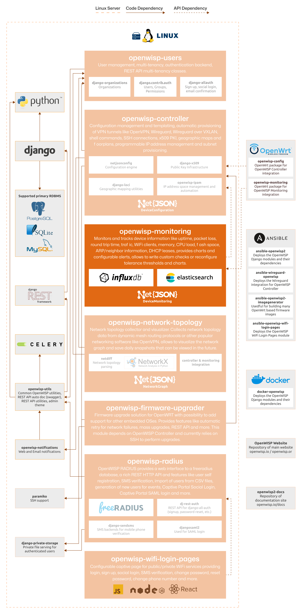

Monitoring
==========

.. seealso::

    **Source code**: `github.com/openwisp/openwisp-monitoring
    <https://github.com/openwisp/openwisp-monitoring>`_.

The OpenWISP Monitoring module leverages the capabilities of Python and the Django
Framework to provide OpenWISP with robust network monitoring features. Designed to be
extensible, programmable, scalable, and user-friendly, this module automates monitoring
checks, alerts, and metric collection, ensuring efficient and comprehensive network
management.

For a comprehensive overview of its features, please refer to the :doc:`user/intro`
page.

The following diagram illustrates the role of the Monitoring module within the OpenWISP
architecture.

    **OpenWISP Architecture: highlighted monitoring module**

.. important::

    For an enhanced viewing experience, open the image above in a new browser tab.

    Refer to :doc:`/general/architecture` for more information.

.. toctree::
    :caption: Monitoring Module Usage Docs
    :maxdepth: 1

    ./user/intro.rst
    ./user/quickstart.rst
    ./user/device-health-status.rst
    ./user/metrics.rst
    ./user/checks.rst
    ./user/device-checks-and-alert-settings
    ./user/configuring-iperf3-check.rst
    ./user/dashboard-monitoring-charts.rst
    ./user/wifi-sessions.rst
    ./user/rest-api.rst
    ./user/settings.rst
    ./user/management-commands.rst

.. toctree::
    :caption: Monitoring Module Developer Docs
    :maxdepth: 2

    Developer Docs Index <developer/index.rst>
